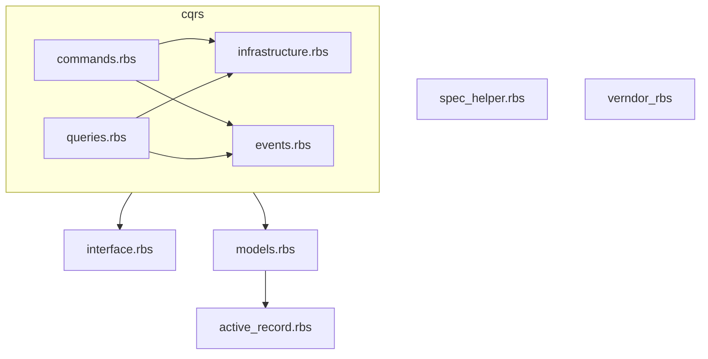

# sig ディレクトリ構成の意図

このプロジェクトでは、sig配下の型定義（RBS）ファイルを「ディレクトリごと・レイヤーごと」に1ファイルずつまとめています。

## なぜこの構成にしているのか？

- **一覧性の向上**  
  各レイヤーや責務ごとに型定義が集約されているため、どんなクラスやメソッドが存在するかを一目で俯瞰できます。

- **全体像の把握がしやすい**  
  型定義ファイルを読むだけで、システム全体の設計思想や責務分担が直感的に理解できます。

- **設計の透明性・学習コストの低減**  
  新規参加者や設計見直し時も、型定義ファイルを見れば全体像がすぐに掴めるため、保守・拡張だけでなくプロジェクトの透明性向上にも役立ちます。

---

このように、「全体像の把握」と「設計の透明性」を最優先にした型定義運用を採用しています。 

## RBSファイルの記述スタイル（public/private分離ルール）

このプロジェクトでは、**RBSファイルの各クラス定義において「publicメソッド」と「privateメソッド」を明確に分離して記述する**ルールを採用しています。

- publicメソッドはクラス定義の上部にまとめて記述
- privateメソッドはファイル末尾の「# privateメソッドだけを定義する」以降に、クラスごとにまとめて再定義

### 例（複数クラスの場合）

```rbs
class Foo
  def foo_public: () -> void
end

class Bar
  def bar_public: (Integer) -> String
end

class Baz
  def baz_public: (String) -> Integer
end

# privateメソッドだけを定義する
class Foo
  private
  def foo_private: () -> void
end

class Bar
  private
  def bar_private: (String) -> void
end

class Baz
  private
  def baz_private: () -> bool
end
```

このスタイルにより、**外部インターフェースと内部実装の責務が明確になり、可読性・保守性が大きく向上**します。  
Steepによる型チェックもこの構成で問題なく動作します。

## active_record.rbs について

このファイルは、RailsのActiveRecord基盤の型定義（interface）を集約したものです。

- ActiveRecordは動的にメソッドや属性が追加されるため、厳密な型付けが困難な箇所が多い
- 代表的なメソッド（where, order, find など）は返り値が多様で、型を特定しづらい
- 柔軟性・拡張性を損なわないため、untypedを多用している

**目的：**
- ドメインモデルやアプリ固有の型定義（models.rbs等）と分離し、責務を明確にする
- ActiveRecord基盤の型定義を一元管理し、他のプロジェクトやレイヤーでも再利用しやすくする

この方針により、型定義の可読性・保守性・拡張性が向上します。

## spec_helper.rbsについて
テスト時限定の補助型定義です。  
本番ロジックの型依存からは外れた場所に配置されており、  
たとえば `SlowCommandHandler` など、検証専用のクラスが定義されています。

テストの型もあえて分離することで、本番環境の型構造にノイズが入らず、保守性と可読性を保っています。

# RBS運用全体方針の補足

ここまでのルールを踏まえて、全体に共通する運用思想を補足します
このプロジェクトでは、RBS（型定義ファイル）を「設計書」として最大限に活用し、  
実装コードと設計の同期・責務分離・可読性向上を徹底しています。

- **型定義優先読解**  
  コードの理解・修正・補完はRBSを最初に参照し、設計意図やインターフェースを明確に把握できるようにしています。

- **public/private分離ルール**  
  各クラス・モジュールのpublicメソッドとprivateメソッドを明確に分離し、  
  外部インターフェースと内部実装の責務を可視化しています。

- **レイヤーごとの型定義ファイル分割**  
  ドメインモデル、ActiveRecord基盤、CQRSコマンド/クエリなど、  
  責務ごとにRBSファイルを分割し、設計の全体像が一目で分かる構成にしています。

- **untypedの利用方針**  
  Rails/ActiveRecordのような動的な基盤部分は、柔軟性・拡張性を損なわないためにuntypedを許容しています。  
  ただし、アプリ固有のドメイン層では型安全性を重視します。

- **Steepによる型チェック**  
  RBSと実装コードの同期をSteepで自動的に担保し、設計と実装のズレを即座に検出できる体制を整えています。

---

この方針により、  
- 設計の透明性・保守性・拡張性  
- 新規参加者の学習コスト低減  
- チーム全体での設計意図の共有

が実現できると考えています。

## 型定義の構造図（Mermaid）

この図は、RBSファイル間の依存関係と責務の関係性を示しています。  
特に `interface.rbs` はすべての型設計の「土台」として設計されており、  
sig/cqrs 以下の各ファイルはレイヤー責務ごとに疎結合で構成されています。

> ※ Mermaid対応Markdownビューア（GitHubやVSCode拡張）で閲覧してください。
